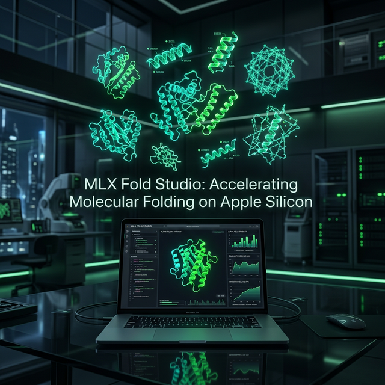
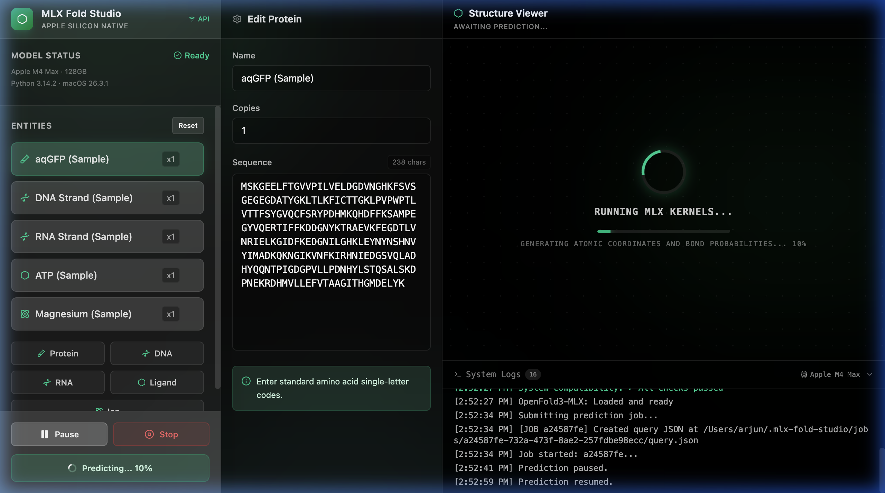
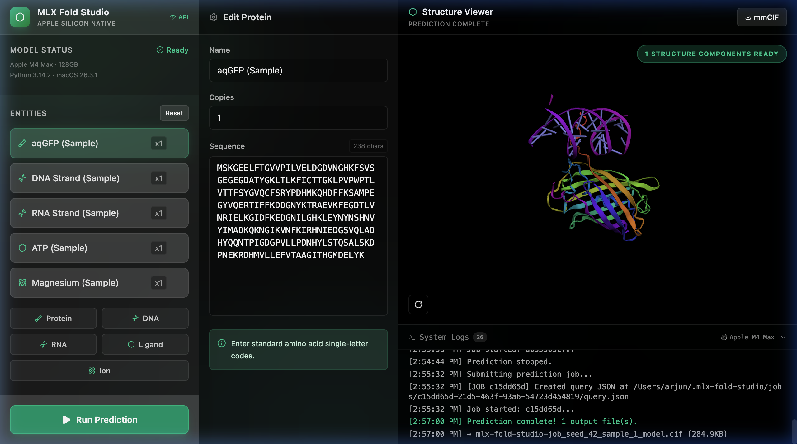

<div align="center">



# 🧬 MLX Fold Studio

**High-performance molecular folding and 3D visualization studio optimized for Apple Silicon.**

[](LICENSE)
[-black?logo=apple)](https://developer.apple.com/metal/tensorflow-plugin/)
[](https://github.com/ml-explore/mlx)
[](https://react.dev/)
[](https://fastapi.tiangolo.com/)

[Explore the App](https://github.com/junainfinity/MLX-Fold-GUI) • [Report Bug](https://github.com/junainfinity/MLX-Fold-GUI/issues) • [Request Feature](https://github.com/junainfinity/MLX-Fold-GUI/issues)

</div>

---

## 🚀 Overview

**MLX Fold Studio** is a state-of-the-art bioinformatics workbench designed specifically for the Mac. It leverages the power of Apple's **MLX framework** and **OpenFold3** to provide lightning-fast protein folding and molecular simulation with a premium, user-friendly interface.

Whether you are a researcher or a hobbyist, MLX Fold Studio brings the power of folded-structure prediction to your desktop with real-time 3D visualization and grain-level job control.

## ✨ Key Features

- ⚡ **Optimized for ML-Explore**: Native performance on Apple Silicon using the latest MLX kernels.
- 🔬 **OpenFold3-MLX Integration**: Seamless access to the latest molecular folding models.
- 🎮 **Job Control 2.0**: Pause, Resume, and Stop prediction jobs with real-time process signals.
- 🧊 **Interactive 3D Viewer**: High-performance visualization powered by `3Dmol.js` with rotation, zoom, and reset capabilities.
- 📜 **Real-time Logging**: Comprehensive streaming logs via WebSockets for every prediction step.
- 🎨 **Premium UI**: Modern, glassmorphic dark-mode interface optimized for productivity.

## 📸 Visual Showcase

<div align="center">

### 🧪 Real-time Prediction & Control

*Grain-level control over MLX kernels with visual progress tracking.*

### 💎 Interactive 3D Visualization

*High-fidelity 3D structure visualization with full interaction support.*

</div>

## 🛠️ Installation

### Prerequisites
- macOS (Apple Silicon M1/M2/M3/M4 recommended)
- Node.js (v18+)
- Python 3.10+
- `aws-cli` (for weight downloads)

### Setup

1. **Clone the repository**
   ```bash
   git clone https://github.com/junainfinity/MLX-Fold-GUI.git
   cd MLX-Fold-GUI
   ```

2. **Backend Setup**
   ```bash
   # Install backend dependencies
   pip install -r requirements.txt
   
   # Start the FastAPI server
   python3 -m uvicorn server.main:app --host 0.0.0.0 --port 8000
   ```

3. **Frontend Setup**
   ```bash
   # Install frontend dependencies
   npm install
   
   # Launch the dev server
   npm run dev
   ```

4. **Model Installation**
   Launch the app in your browser at `http://localhost:3000` and click the **"Install & Load OpenFold3-MLX"** button. The app will automatically handle the environment setup and model weight downloads (~2GB).

## 🧰 Technology Stack

- **Frontend**: React 19, Vite, TailwindCSS, Motion, 3Dmol.js
- **Backend**: FastAPI (Python), Uvicorn, WebSockets
- **Deep Learning**: ML-Explore (MLX), OpenFold3-MLX
- **Icons**: Lucide React

## 📄 License

This project is licensed under the MIT License - see the [LICENSE](LICENSE) file for details.

## 🤝 Contributing

Contributions are welcome! Please see [CONTRIBUTING.md](CONTRIBUTING.md) for details on our code of conduct and the process for submitting pull requests.

---

<div align="center">
Built with ❤️ for the Molecular Science Community by <a href="https://github.com/junainfinity">@junainfinity</a>
</div>
